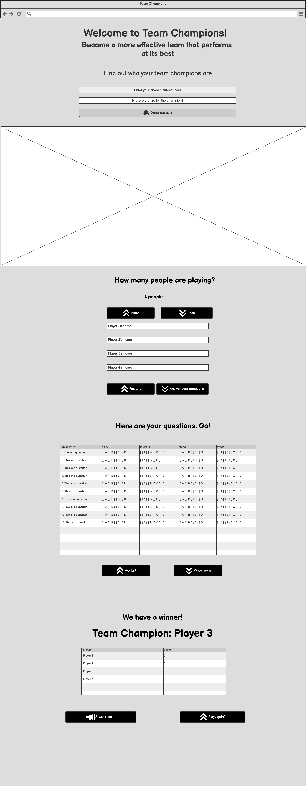
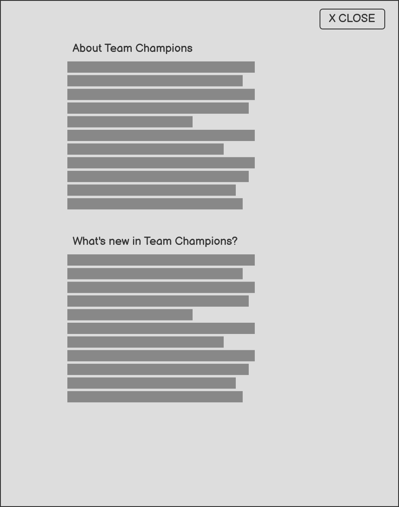

# Team Champions
*An interactive frontend project for Code Institute's Level 5 Diploma in Web Development*

---
## Contents

1. User Experience (UX)
   - Project Goals
   - Developer Goals
   - User Stories
   - Design Choices
     - Colour Scheme
     - Typography
     - Imagery
   - Wireframes
2. Features
   - Existing Features
   - Features Left to Implement
3. Technologies Used
4. Testing
5. Deployment
   - How to run this project locally
6. Credits
   - Content
   - Media
   - Code
   - Acknowledgements

## 1. User Experience (UX)
### Project Goals
The primary goal of Team Champions is to provide an easy to use,
app for sharing a bit of fun within a group of people and for someone to become the Team Champion.
The app will use AI to generate a set of questions based on the user inputted subject, allow a variable
amount of players and will provide a readout of players' scores at the end.

### Developer Goals
1. To fulfil the requirements of Code Institute's Level 5 Diploma in Web Development Milestone 2 project.
2. To exercise key frontend skills:

   - Taking user input and using this to communicate with an external API and use the response within the app
   - Use HTML and CSS to produce an attractive and accessible interface.
   - To extend current knowledge and skill-set into the realm of using AI APIs.

### User Stories

First Time Visitors

  ### 1.  As a first-time user, I want to easily understand the purpose of the app so that I can decide if it's something I want to use.

  #### Acceptance Criteria

  - Must have a clear heading to introduce the app.
  - Must have a brief introductory opening to sign-post what the user should do.

  **Tasks**

  - [ ] Design and implement landing page layout
  - [ ] Write clear, concise app description
  - [ ] Create "How to Play" content
  - [ ] Add relevant icons or illustrations
  - [ ] Implement responsive design for landing page

  ### 2. As a first-time user, I want clear instructions on how to start a quiz so that I can begin playing without confusion.

  #### Acceptance Criteria
  - Must have a prominently displayed start button
  - Must have a step-by-step guide available for first-time users
  - Must have clear visual cues indicate where to begin
  - Must have helpful error messages that guide users to correct actions

  **Tasks**
  - [ ] Design quiz setup flow
  - [ ] Create step-by-step guide component
  - [ ] Implement start button and setup form
  - [ ] Add input validation with helpful error messages
  - [ ] Test user flow with sample users

Quiz Host

### 1. As a quiz host, I want to input a subject for the quiz so that I can create questions relevant to my group's interests.
**Acceptance Criteria**

- Must have a clearly visible subject input field

**Tasks**
- [ ] Create subject input
- [ ] Integrate with AI API
- [ ] Add loading states during AI processing

### 2. As a first-time user, I want to be able to select the number of players so that I can play with my friends.

** Acceptance Criteria **
- Must be able to select between 1-10 players
- Must be able to assign a name to each player
- Must update the interface to reflect the number of players selected
- Must inform the user of boundaries to the number of players selectable

**Tasks**
- [ ] Create a player count selector
- [ ] Implement dynamic player name input fields
- [ ] Add validation for player count and names
- [ ] Test different player configurations

Quiz Player

### 1. As a quiz player, I want to be able to see my ranking compared to other players so that I know how well I'm doing.

**Acceptance Criteria:**
- Must have a leaderboard that shows all players' scores
- Must clearly show the differences between players
- Must clearly show who the winner is

**Tasks:**
- [ ] Design and implement leaderboard component
- [ ] Design and implement display of winner
- [ ] Create leaderboard sorting and ranking logic

Accessibility

### 1. As a user, I want the interface to be clear and sufficiently high contrast so that I can easily read the questions and answers.

**Acceptance Criteria:**
- Must have text that meets WCAG 2.1 Level AA contrast requirements (minimum 4.5:1 for normal text, 3:1 for large text)
- Must set font size as: minimum 16px for body text and 20px for headings
- Must give interactive elements (buttons, links) distinct hover and focus states
- Must convey information so that colour is not the only means of conveying information
- Must clearly differentiate questions and answer options

**Tasks:**
- [ ] Implement a color palette that meets contrast requirements
- [ ] Create CSS custom properties (variables) for consistent color implementation
- [ ] Design and implement focus states for all interactive elements
- [ ] Set up typography with appropriate sizes and line heights
- [ ] Add visual indicators (icons, patterns) to supplement color-based information
- [ ] Create distinctive styles for questions vs. answer options

### 2. As a user on a mobile device, I want the app to be fully responsive so that I can play comfortably on my phone or tablet.

**Acceptance Criteria:**
- Must have an interface that is usable on devices from 320px to 2000px width
- Pages must not allow horizontal scrolling at any viewport width
- Must have touch targets that are at least 44x44px on mobile devices
- Must support landscape and portrait orientations

**Tasks:**
- [ ] Set up responsive breakpoints (mobile, tablet, desktop)
- [ ] Create mobile-first CSS layout using flexbox
- [ ] Implement touch-friendly button and input sizes
- [ ] Create responsive typography scale
- [ ] Optimize images for different screen sizes
- [ ] Implement responsive spacing system
- [ ] Test and adjust tap targets for touch accuracy
- [ ] Test on various devices and browsers
- [ ] Implement media queries for orientation changes
- [ ] Document responsive breakpoints and design decisions

[[Back to contents]](#contents)

---

### Design Choices
#### Colour Scheme
#### Typography
#### Imagery

[[Back to contents]](#contents)

---

### Wireframes
- Quiz Page

- Utility Panel

[[Back to contents]](#contents)

---

## 2. Features
### Existing Features
### Features Left to Implement
**Returning Users**
1. As a returning user, I want to be able to see my previous scores so that I can track my improvement over time.
2. As a returning user, I want to be able to quickly start a new game with the same settings as before so that I can save time on setup.

**Administrative**
1. As the site owner, I want to track usage statistics so that I can monitor the app's performance and popularity.

**Host**
1. As a quiz host, I want to be able to review the AI-generated questions before starting so that I can ensure they're appropriate for my group.

[[Back to contents]](#contents)

---

## 3. Technologies Used
- [Languages](#languages)
- [Frameworks and Libraries](#frameworks--libraries)
- [Software & Tools](#software--tools)

### Languages
**JavaScript**

### Frameworks & Libraries
- NodeJS

### Software & Tools
- Heroku
- JetBrains WebStorm

[[Back to contents]](#contents)

---

## 4. Testing

I carried a series of manual tests to ensure

[[Back to contents]](#contents)

---

## 5. Deployment
### How to run this project locally

[[Back to contents]](#contents)

---

## 6. Credits
### Content
### Media
### Code
### Acknowledgements

[[Back to contents]](#contents)
